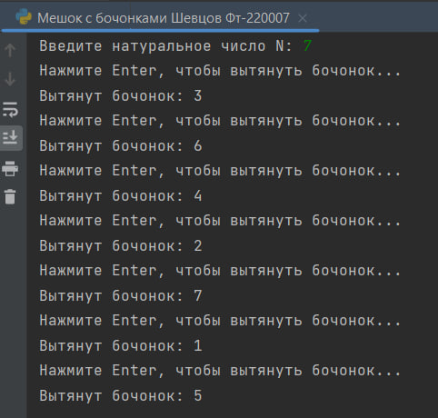
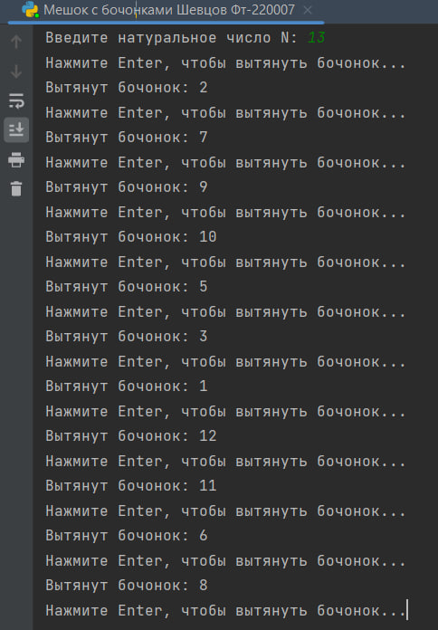
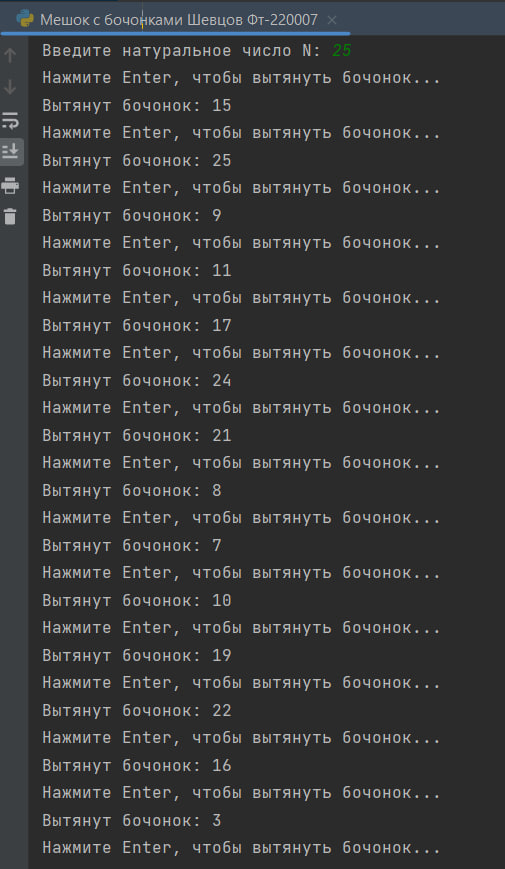

# Исполнитель
Шевцов Михаил
Фт-220007

# Лабораторная работа №9 - Мешок с бочонками
Пользователь вводит N кол-во бочонков в мешке, программа выдаёт случайно вытащенные бочёнок и отмечает их номера в log-файле 

# Среда разработки
Язык программирования Python
Среда разработки PyCharm Edu 2022.2.2

# Инструкция по работе
Чтобы запустить программу, нужно открыть файл с названием “Мешок с бочонками Шевцов Фт-220007.py” в любом компиляторе кода, поддерживающем язык Python, начать тест и следовать указаниям программы.

## Тесты
Тест N=7
___

___
Тест N=13
___

___
Тест N=25
___

